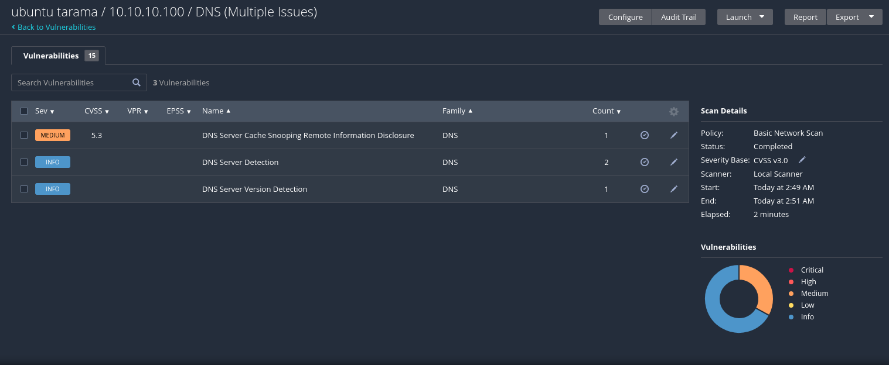
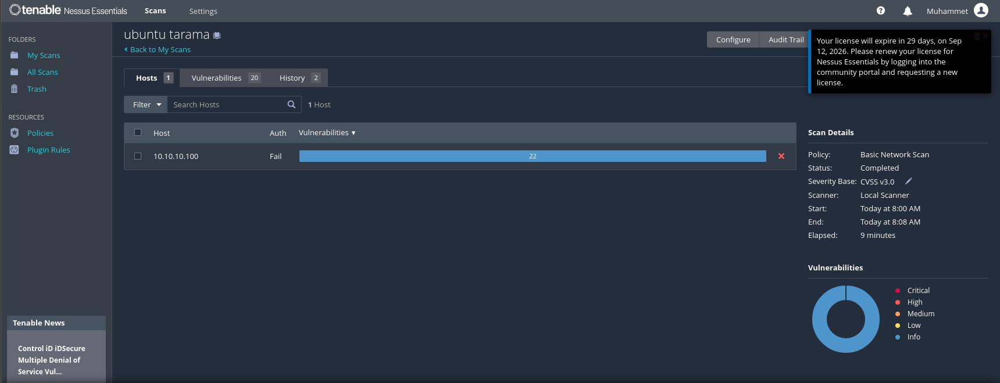
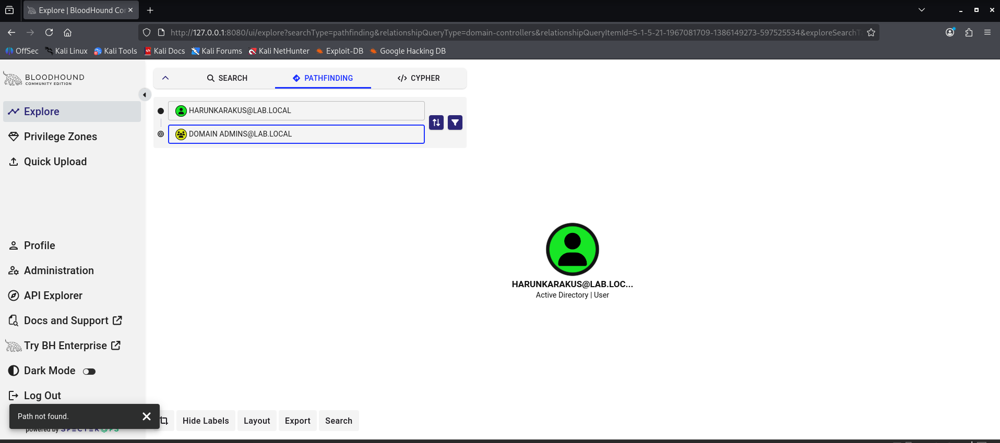
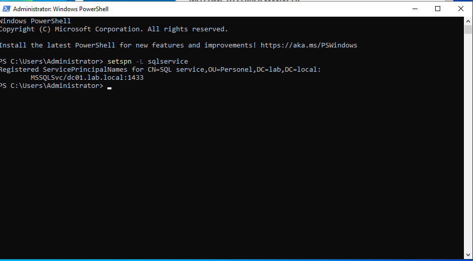
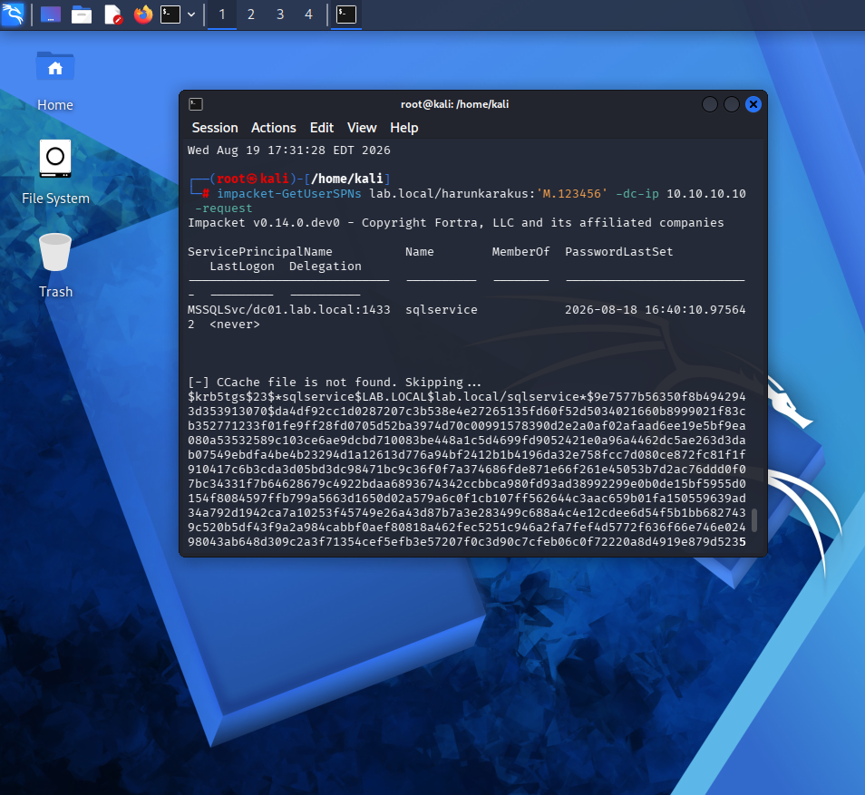
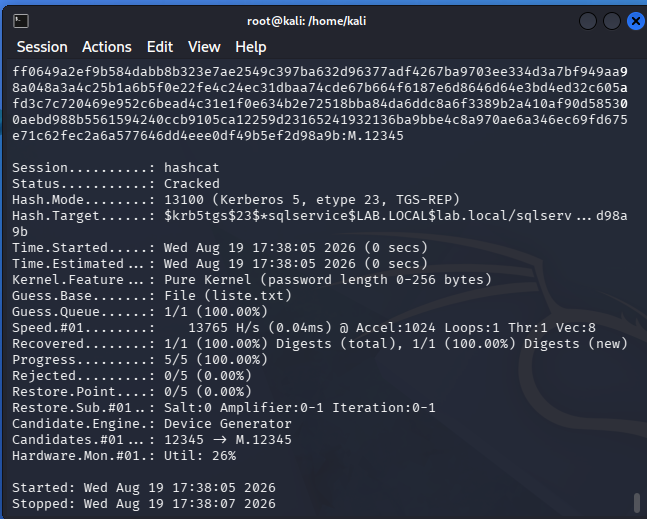
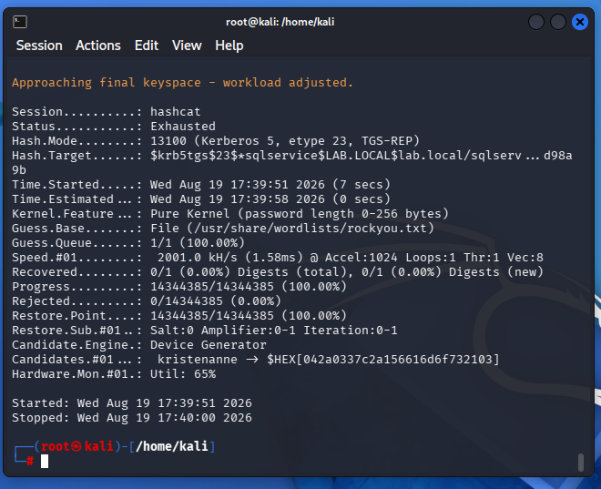
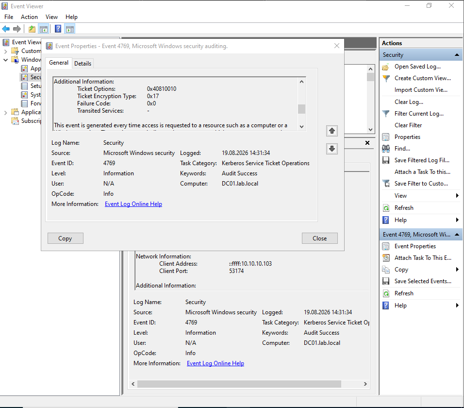

Ağ ve Sistem Güvenliği Lab Projesi
Bu proje, staj sürecim kapsamında sanal ortamda kurduğum, gerçekçi ölçekte bir kurumsal ağın güvenliğini uçtan uca deneyimlemek amacıyla hazırlanmıştır. Sıfırdan bir ağ altyapısı kurup, üzerine kimlik yönetimi, loglama, ve hem uç nokta hem ağ seviyesinde saldırı tespiti ekledim; gerçek saldırı senaryolarını (brute-force, SQL injection) deneyerek bu savunma katmanlarının nasıl çalıştığını kanıtladım; son olarak otomatik zafiyet taraması ve sistem sertleştirme (hardening) çalışmasıyla projeyi "saldırı-tespit" döngüsünün ötesine, "bul ve düzelt" döngüsüne taşıdım.
Kullanılan Araçlar
VMware Workstation Pro — sanallaştırma platformu
pfSense — firewall / router
Windows Server 2022 — Active Directory Domain Controller
Windows 11 — domain istemcisi
Kali Linux — saldırgan makine
OWASP Broken Web Applications (DVWA) — hedef zafiyetli web uygulaması
Sysmon — uç nokta (endpoint) loglama
Suricata — ağ seviyesinde saldırı tespit sistemi (IDS)
Tenable Nessus — zafiyet taraması ve güvenlik analizi
ufw / fail2ban — Linux güvenlik duvarı ve otomatik saldırı engelleme
BloodHound CE — Active Directory ilişki/izin haritalama ve saldırı yolu analizi
Impacket — Kerberos protokolüyle etkileşim kuran saldırı araç seti
hashcat — çevrimdışı şifre/hash kırma
Ağ Mimarisi
Tüm sanal makineler, pfSense'in LAN arayüzüne bağlı `10.10.10.0/24` adresli izole bir sanal ağda (VMware host-only network) çalışıyor. pfSense, bu iç ağ ile dış dünya arasındaki tek geçiş noktası; NAT ile internete çıkışı sağlıyor, DHCP ile iç ağdaki makinelere IP dağıtıyor.
```
İnternet
   │
 [pfSense: WAN/LAN]
   │
 Sanal LAN (10.10.10.0/24)
   │
   ├── DC01 (Domain Controller) — 10.10.10.10
   ├── Windows 11 (domain istemcisi)
   ├── Ubuntu — 10.10.10.100
   ├── Kali Linux (saldırgan)
   └── OWASP BWA / DVWA — 10.10.10.104
```
1. Ağ Altyapısı ve Firewall
pfSense üzerinde WAN/LAN ayrımı yapılandırıldı, NAT ile internet çıkışı ve DHCP ile iç ağ IP dağıtımı sağlandı.

2. Kimlik ve Erişim Yönetimi (Active Directory)
DC01 üzerinde bir Organizational Unit (OU) ve bu OU altında kullanıcılar oluşturuldu. Bu OU'ya bağlı bir Group Policy Object (GPO) ile minimum 10 karakter ve karmaşıklık zorunluluğu içeren bir parola politikası tanımlandı.


3. Güvenlik Politikasının Doğrulanması
Tanımlanan parola politikasının gerçekten çalıştığını doğrulamak için domaine katılmış bir Windows 11 istemcisinde zayıf bir şifre denendi ve sistem tarafından reddedildi.

4. Saldırı Simülasyonu ve Uç Nokta Tespiti
Kali Linux üzerinden DC01'e karşı `netexec` ile bir SMB brute-force (şifre tahmin) saldırısı gerçekleştirildi.

Bu saldırı, DC01 üzerine kurulan Sysmon ve Windows'un yerleşik güvenlik loglaması (Event Viewer) sayesinde tespit edildi — başarısız giriş denemeleri, kaynak IP adresiyle birlikte kayıt altına alındı.


5. Web Uygulama Güvenlik Testi (SQL Injection)
OWASP Broken Web Applications üzerindeki DVWA hedef alınarak, kullanıcı girdisinin veritabanı sorgusuyla doğrudan birleştirilmesinden kaynaklanan bir SQL Injection açığı test edildi. `1' OR '1'='1` girdisiyle, tek bir kullanıcı yerine veritabanındaki tüm kullanıcı kayıtları elde edildi.

6. Ağ Seviyesinde Saldırı Tespiti (Suricata IDS)
pfSense üzerine kurulan Suricata IDS, SQL Injection saldırı trafiğini ağ seviyesinde (hedefe ulaşmadan) tespit edip uyarı üretti.

7. Zafiyet Taraması ve Analizi (Tenable Nessus)
Laboratuvar ortamında yer alan hedef makineye (`10.10.10.104` — OWASP BWA) Tenable Nessus üzerinden Basic Network Scan politikasıyla bir zafiyet taraması (vulnerability assessment) gerçekleştirildi.

Tarama özeti:
Hedef sistem: `10.10.10.104` (OWASP BWA)
Tamamlanma süresi: 17 dakika
Bulgu dağılımı: 🔴 Critical: 3 · 🟠 High: 12 · 🟡 Medium: 6 · 🔵 Info: 78
Öne çıkan bulgular:
A. Desteği sonlandırılmış işletim sistemi (Critical, CVSS 10.0) — Canonical Ubuntu Linux SEoL (10.04.x), Plugin ID 201475. Hedef sistemin, güvenlik desteği 2015'te sona ermiş bir Ubuntu 10.04 üzerinde çalıştığı tespit edildi. 11 yıldır yama almayan bir çekirdek, uzaktan kod çalıştırma (RCE) ve yetki yükseltme saldırılarına açık kapı bırakıyor. Çözüm: güncel bir LTS sürümüne yükseltme.

B. Güvensiz şifreleme protokolleri (Critical, CVSS 9.8) — SSL Version 2 and 3 Protocol Detection, Plugin ID 20007. Servisin, ciddi kriptografik zayıflıklar barındıran SSL 2.0/3.0 üzerinden bağlantı kabul ettiği görüldü — bu, araya girme (MitM) ve POODLE gibi düşürme (downgrade) saldırılarına zemin hazırlıyor. Çözüm: SSL 2.0/3.0'ı tamamen kapatıp yalnızca TLS 1.2/1.3'e izin vermek.

C. Desteği sonlandırılmış Python sürümü (High) — Port 80'de çalışan uygulamanın, resmi desteği 2013'te bitmiş Python 2.6.5 kullandığı tespit edildi.
D. ICMP Timestamp bilgi ifşası (Low) — Sistem, ICMP zaman damgası isteklerine cevap vererek sistem saatini dışarıya sızdırıyordu.
8. Linux Sertleştirme (Hardening) ve Önce/Sonra Karşılaştırması
Zafiyet taramasının Ubuntu (`10.10.10.100`) için de anlamlı sonuçlar verdiğini görünce, bu makineyi bilinçli olarak sertleştirip ölçülebilir bir iyileştirme ortaya koymak istedim. Önce mevcut haliyle bir tarama yapıp bulguları kaydettim, ardından aşağıdaki değişiklikleri uyguladım:
Gereksiz servis kaldırma: Kullanılmayan ama tüm ağa açık şekilde dinleyen bir DNS sunucusu (`bind9`) tespit edilip kaldırıldı — "en az işlevsellik" prensibi gereği, ihtiyaç duyulmayan hiçbir servis açık bırakılmamalı.
Bilgi sızıntısını kapatma: ICMP timestamp isteklerine verilen cevaplar `iptables` ile engellendi.
SSH sertleştirme: Parola ile giriş tamamen kapatılıp yalnızca SSH anahtarıyla kimlik doğrulamaya geçildi, `root` kullanıcısının doğrudan girişi engellendi — bu, brute-force saldırılarını anlamsız hale getirir.
Güvenlik duvarı: `ufw` etkinleştirilip yalnızca SSH (port 22) açık bırakıldı, geri kalan tüm gelen bağlantılar varsayılan olarak reddedildi.
Saldırı engelleme: `fail2ban` kurulup SSH servisini izlemesi ve tekrarlı başarısız denemelerde ilgili IP'yi otomatik olarak geçici süreliğine engellemesi sağlandı.
Değişikliklerin ardından aynı hedefe tarama tekrarlandı:
	Önce	Sonra
Critical / High	0	0
Medium	1 (DNS Cache Snooping)	0
Low	1 (ICMP Timestamp)	0
Info	birkaç	birkaç (yalnızca zararsız bilgilendirme)


Bu karşılaştırma, projenin yalnızca "açık bulma" değil, "açığı kapatıp bunu kanıtlama" aşamasına da ulaştığını gösteriyor.
9. Active Directory Haritalama ve Saldırı Yolu Analizi (BloodHound)
Gerçek AD ortamlarında, sıradan bir kullanıcı hesabı bile birbirine zincirlenmiş izinler yüzünden Domain Admin yetkisine kadar ulaşabilir. Bu "gizli yolları" tespit etmek için BloodHound CE kuruldu; `bloodhound-python` collector'ı ile domain'den veri toplandı (7 kullanıcı, 52 grup, 3 bilgisayar, 3 GPO) ve BloodHound arayüzüne yüklendi.
Hem sıradan bir kullanıcıdan hem de domaine katılmış bir istemciden Domain Admins grubuna dolaylı bir izin zinciri (attack path) olup olmadığı sorgulandı — her iki denemede de yol bulunamadı, Domain Admins grubunun tek üyesinin `administrator` olduğu doğrulandı. Bu, ortamın izin yapısının temiz olduğunu, kazara oluşmuş bir yetki yükseltme yolunun bulunmadığını gösteriyor.

10. Kerberoasting Saldırısı ve Çevrimdışı Şifre Kırma
Kerberoasting, AD'de SPN (Service Principal Name) atanmış servis hesaplarını hedef alan bir saldırı tekniğidir: herhangi bir kimlik doğrulanmış kullanıcı, bu hesaplar için şifrelenmiş bir Kerberos servis bileti isteyebilir ve bu bileti hedefe hiç bağlanmadan, çevrimdışı olarak kırmaya çalışabilir.
Bunu test etmek için DC01 üzerinde bilinçli olarak zayıf şifreli bir servis hesabı (`sqlservice`) oluşturulup bir SPN atandı.

Kali üzerinden, sıradan bir domain kullanıcısı (`harunkarakus`) kimliğiyle — herhangi bir yönetici yetkisi olmadan — Impacket'in `GetUserSPNs` aracıyla bu hesabın Kerberos bileti istendi ve şifreli hash yakalandı.

Yakalanan hash, `hashcat` ile çevrimdışı olarak kırıldı ve servis hesabının gerçek şifresi (`M.12345`) elde edildi.

Şifrenin gerçekçi bir saldırı senaryosuna ne kadar dayanıklı olduğunu test etmek için, aynı hash 14+ milyon sızmış şifre içeren `rockyou.txt` listesiyle de denendi — şifre bu listede bulunamadı (`Exhausted`), yani basit bir sözlük saldırısına karşı dayanıklı çıktı.

Son olarak bu saldırı, DC01'in Event Viewer'ında Event ID 4769 (Kerberos servis bileti talebi) altında, Ticket Encryption Type: 0x17 (RC4) imzasıyla tespit edildi — gerçek SOC ortamlarında Kerberoasting'i ayırt etmek için kullanılan standart bir gösterge, çünkü saldırı araçları genelde kırılması daha kolay olan eski RC4 şifrelemesini talep eder.

Öğrenilenler
Bu proje sürecinde ağ topolojisi kurulumu, Active Directory ile kimlik/erişim yönetimi, Windows ve Linux platformlarında loglama, uç nokta ve ağ seviyesinde saldırı tespiti, temel web uygulama güvenlik açıkları, otomatik zafiyet taraması, sistem sertleştirme ve Active Directory'ye özgü saldırı tekniklerinde (attack path analizi, Kerberoasting) uygulamalı deneyim kazandım. Ayrıca gerçek bir laboratuvar ortamında karşılaşılan DNS, Kerberos saat senkronizasyonu, ağ görünürlüğü (promiscuous mode) ve donanım seviyesi paket işleme gibi teknik sorunları teşhis edip çözme sürecinden önemli bir troubleshooting deneyimi edindim. Son olarak, bir güvenlik bulgusunu yalnızca tespit etmekle kalmayıp, önce/sonra karşılaştırmasıyla kanıtlanabilir şekilde gidermenin ve bir saldırının gerçek dünyadaki tespit imzalarını (event ID, encryption type gibi) anlamanın nasıl bir disiplin gerektirdiğini deneyimledim.
