Ağ ve Sistem Güvenliği Lab Projesi
Bu proje, staj sürecim kapsamında sanal ortamda kurduğum, gerçekçi ölçekte bir kurumsal ağın güvenliğini uçtan uca deneyimlemek amacıyla hazırlanmıştır. Sıfırdan bir ağ altyapısı kurup, üzerine kimlik yönetimi, loglama, ve hem uç nokta hem ağ seviyesinde saldırı tespiti ekledim; ayrıca gerçek saldırı senaryolarını (brute-force, SQL injection) deneyerek bu savunma katmanlarının nasıl çalıştığını kanıtladım.
Kullanılan Araçlar
VMware Workstation Pro — sanallaştırma platformu
pfSense — firewall / router
Windows Server 2022 — Active Directory Domain Controller
Windows 11 — domain istemcisi
Kali Linux — saldırgan makine
OWASP Broken Web Applications (DVWA) — hedef zafiyetli web uygulaması
Sysmon — uç nokta (endpoint) loglama
Suricata — ağ seviyesinde saldırı tespit sistemi (IDS)
Tenable Nessus — zafiyet taraması ve güvenlik analizi yazılımı
Ağ Mimarisi
Tüm sanal makineler, pfSense'in LAN arayüzüne bağlı `10.10.10.0/24` adresli izole bir sanal ağda (VMware host-only network) çalışıyor. pfSense, bu iç ağ ile dış dünya arasındaki tek geçiş noktası; NAT ile internete çıkışı sağlıyor, DHCP ile iç ağdaki makinelere IP dağıtıyor.
```
İnternet
   │
 [pfSense: WAN/LAN]
   │
 Sanal LAN (10.10.10.0/24)
   │
   ├── DC01 (Domain Controller) — 10.10.10.10
   ├── Windows 11 (domain istemcisi)
   ├── Ubuntu
   ├── Kali Linux (saldırgan)
   └── OWASP BWA / DVWA — 10.10.10.104
```
1. Ağ Altyapısı ve Firewall
pfSense üzerinde WAN/LAN ayrımı yapılandırıldı, NAT ile internet çıkışı ve DHCP ile iç ağ IP dağıtımı sağlandı.
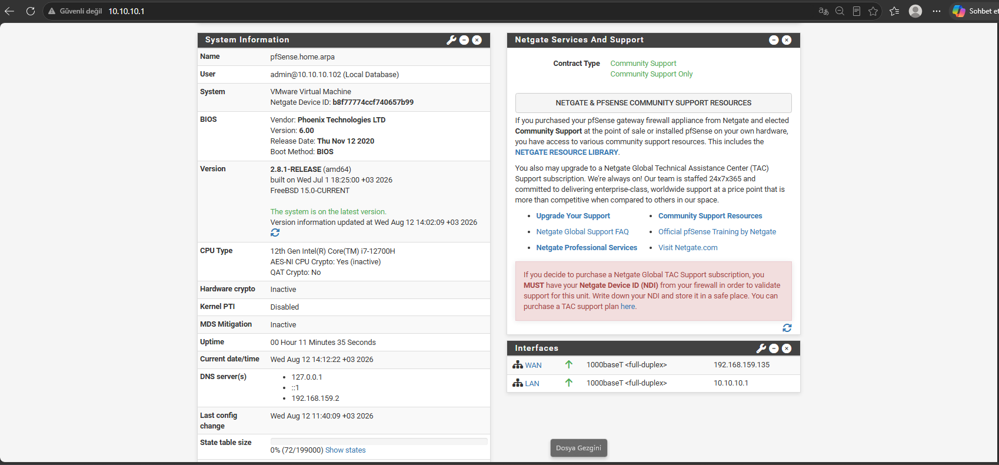
2. Kimlik ve Erişim Yönetimi (Active Directory)
DC01 üzerinde bir Organizational Unit (OU) ve bu OU altında kullanıcılar oluşturuldu. Bu OU'ya bağlı bir Group Policy Object (GPO) ile minimum 10 karakter ve karmaşıklık zorunluluğu içeren bir parola politikası tanımlandı.
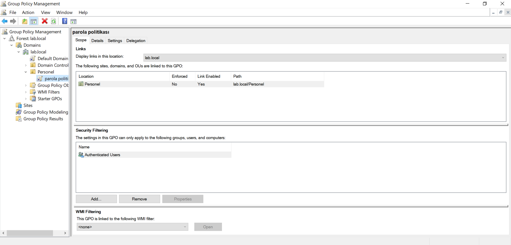

3. Güvenlik Politikasının Doğrulanması
Tanımlanan parola politikasının gerçekten çalıştığını doğrulamak için domaine katılmış bir Windows 11 istemcisinde zayıf bir şifre denendi ve sistem tarafından reddedildi.
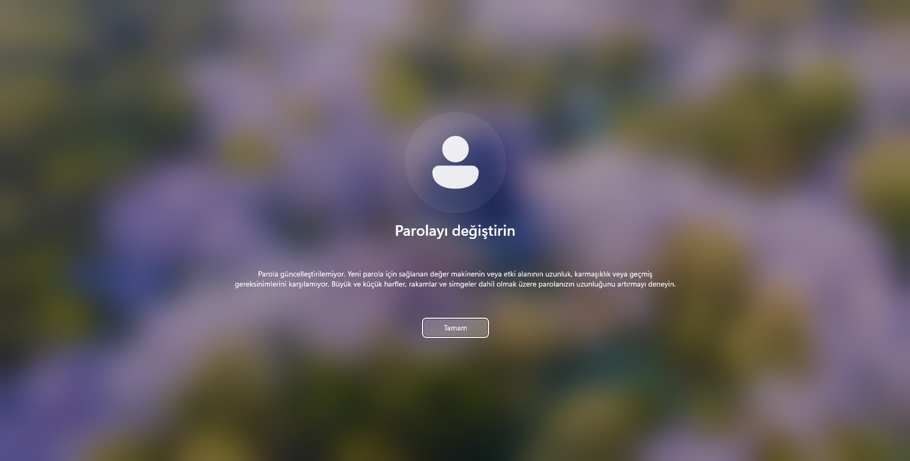
4. Saldırı Simülasyonu ve Uç Nokta Tespiti
Kali Linux üzerinden DC01'e karşı `netexec` ile bir SMB brute-force (şifre tahmin) saldırısı gerçekleştirildi.
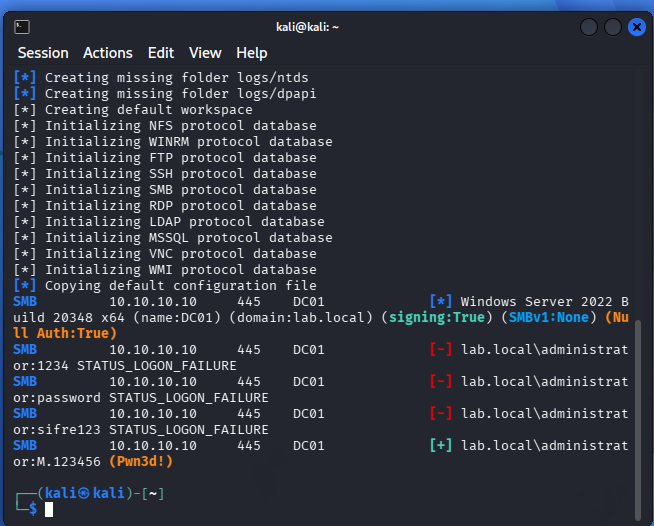
Bu saldırı, DC01 üzerine kurulan Sysmon ve Windows'un yerleşik güvenlik loglaması (Event Viewer) sayesinde tespit edildi — başarısız giriş denemeleri, kaynak IP adresiyle birlikte kayıt altına alındı.
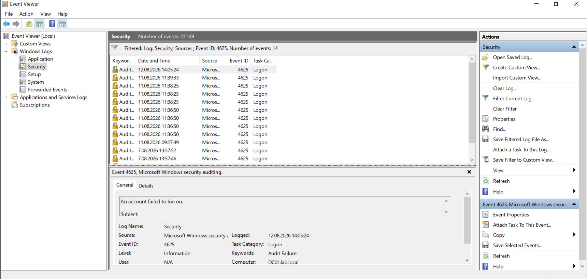
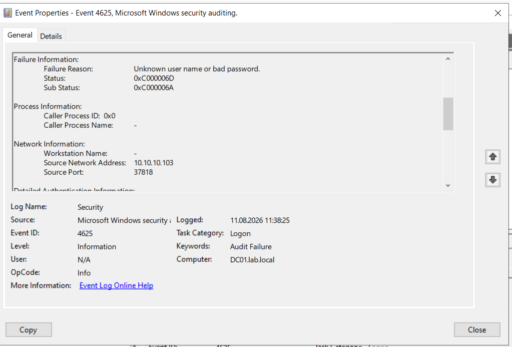
5. Web Uygulama Güvenlik Testi (SQL Injection)
OWASP Broken Web Applications üzerindeki DVWA hedef alınarak, kullanıcı girdisinin veritabanı sorgusuyla doğrudan birleştirilmesinden kaynaklanan bir SQL Injection açığı test edildi. `1' OR '1'='1` girdisiyle, tek bir kullanıcı yerine veritabanındaki tüm kullanıcı kayıtları elde edildi.
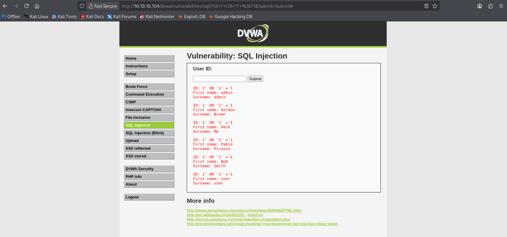
6. Ağ Seviyesinde Saldırı Tespiti (Suricata IDS)
pfSense üzerine kurulan Suricata IDS, SQL Injection saldırı trafiğini ağ seviyesinde (hedefe ulaşmadan) tespit edip uyarı üretti.
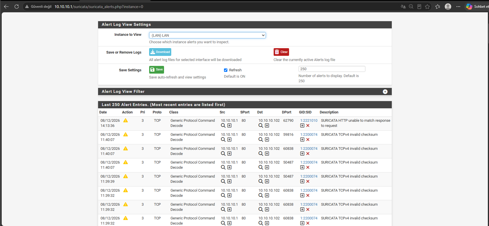
---

## 10. Zafiyet Taraması ve Analizi (Tenable Nessus)

Laboratuvar ortamında yer alan hedef makineye (`10.10.10.104` - OWASP BWA) **Tenable Nessus** güvenlik yazılımı üzerinden **Basic Network Scan** politikası kullanılarak zafiyet taraması (Vulnerability Assessment) gerçekleştirilmiştir.

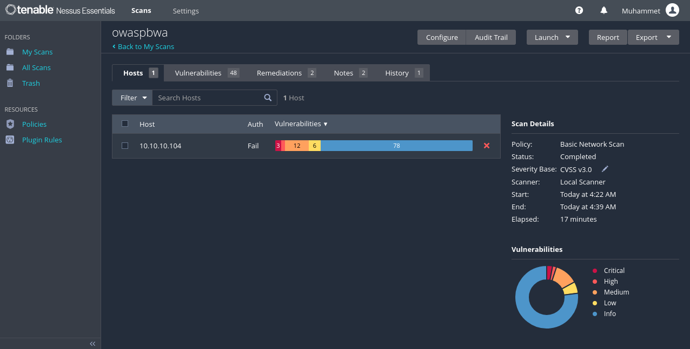

### Tarama Genel Bilgileri ve Zafiyet Dağılımı
* **Hedef Sistem:** `10.10.10.104` (OWASP BWA)
* **Tarama Tipi:** Basic Network Scan
* **Tamamlanma Süresi:** 17 dakika
* **Tespit Edilen Zafiyet Dağılımı:**
  * 🔴 **Critical (Kritik):** 3
  * 🟠 **High (Yüksek):** 12
  * 🟡 **Medium (Orta):** 6
  * 🔵 **Info (Bilgilendirme):** 78

---

### Tespit Edilen Önemli Zafiyetler ve Analizleri

#### A. Desteği Sonlandırılmış İşletim Sistemi (Critical - CVSS 10.0)
* **Zafiyet Adı:** Canonical Ubuntu Linux SEoL (10.04.x)
* **Risk Derecesi:** Critical (CVSS v3.0: 10.0)
* **Plugin ID:** 201475
* **Açıklama:** Hedef sunucuda güvenlik desteği 30 Nisan 2015 tarihinde bitmiş (SEoL) Ubuntu 10.04 kullanıldığı saptanmıştır.
* **Etki:** 11 yıldır güvenlik yaması almayan sistem, çekirdek (Kernel) seviyesinde bilinen tüm zafiyetlere açıktır. Saldırganların uzaktan kod çalıştırma (RCE) veya yetki yükseltme (Privilege Escalation) ile `root` yetkisi almasını kolaylaştırır.
* **Çözüm:** Sunucu altyapısı aktif destek alan güncel bir Ubuntu LTS sürümüne (örneğin Ubuntu 22.04 LTS veya 24.04 LTS) yükseltilmelidir.

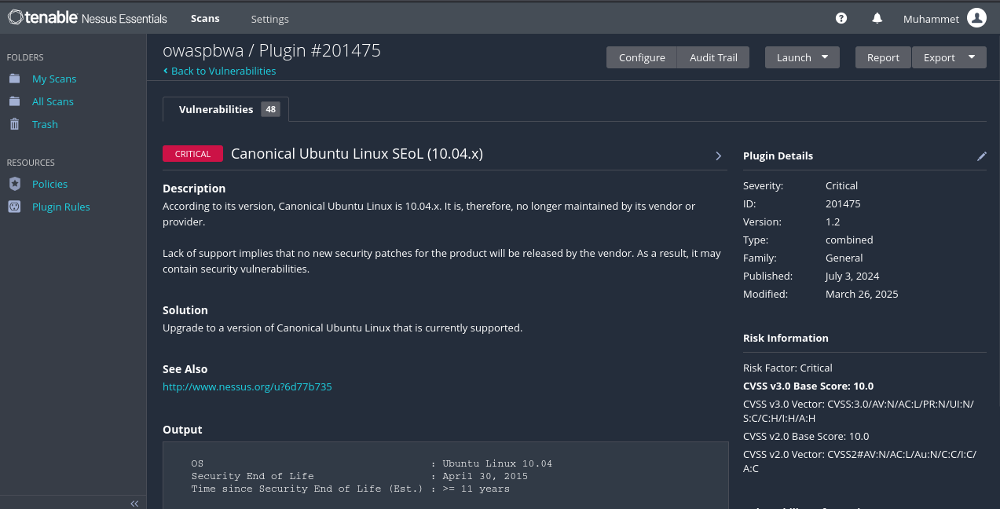

#### B. Güvensiz Şifreleme Protokolleri Desteği (Critical - CVSS 9.8)
* **Zafiyet Adı:** SSL Version 2 and 3 Protocol Detection
* **Risk Derecesi:** Critical (CVSS v3.0: 9.8)
* **Plugin ID:** 20007
* **Açıklama:** Web servisinin ciddi kriptografik zayıflıklar barındıran SSL 2.0 ve SSL 3.0 protokolleri üzerinden bağlantı kabul ettiği tespit edilmiştir.
* **Etki:** Saldırganların araya girme (MitM) saldırıları yapmasına, trafiğin şifresini çözmesine veya bağlantı seviyesini düşürmesine (POODLE vb. Downgrade) imkan tanır.
* **Çözüm:** Sunucu/servis konfigürasyonundan SSL 2.0 ve SSL 3.0 tamamen devre dışı bırakılmalı; yalnızca TLS 1.2 veya TLS 1.3 aktif edilmelidir.

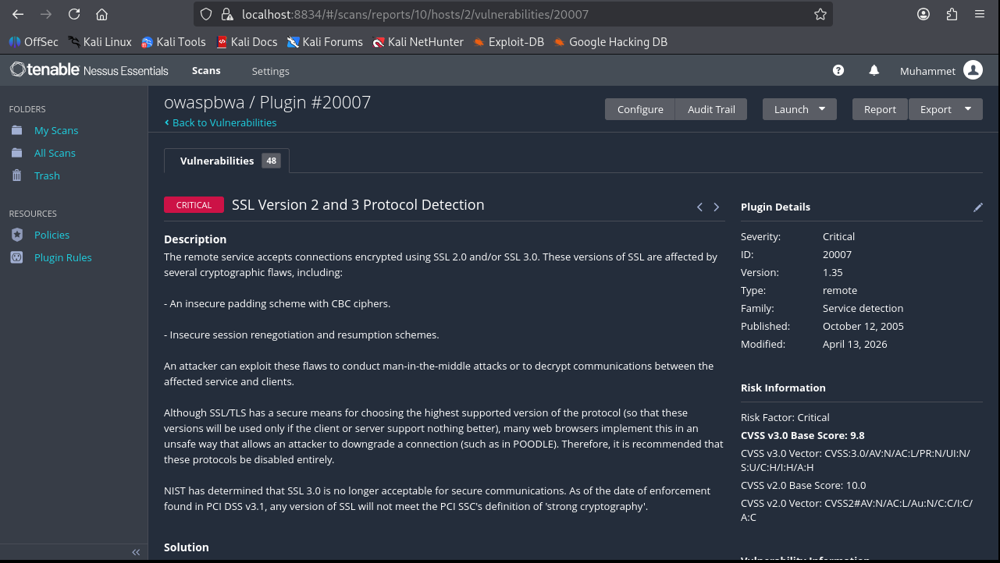

#### C. Desteği Sonlandırılmış Python Sürümü (High)
* **Açıklama:** Port 80 üzerinde çalışan uygulamanın, resmi desteği 2013 yılında bitmiş Python 2.6.5 kullandığı saptanmıştır.
* **Çözüm:** Uygulama altyapısının aktif destek alan güncel Python 3.x sürümüne yükseltilmesi gerekmektedir.

#### D. ICMP Timestamp Bilgi İfşası (Low)
* **Açıklama:** Hedef sistemin ICMP zaman damgası isteklerine yanıt vererek sistem saatini dışarıya sızdırdığı görülmüştür.
* **Çözüm:** Güvenlik duvarı (Firewall) üzerinden ICMP Type 13 ve Type 14 paketleri engellenmiştir.

Öğrenilenler
Bu proje sürecinde ağ topolojisi kurulumu, Active Directory ile kimlik/erişim yönetimi, Windows ve Linux platformlarında loglama, uç nokta ve ağ seviyesinde saldırı tespiti, ve temel web uygulama güvenlik açıkları konularında uygulamalı deneyim kazandım. Ayrıca gerçek bir laboratuvar ortamında karşılaşılan DNS, Kerberos ve ağ görünürlüğü (promiscuous mode) gibi teknik sorunları teşhis edip çözme sürecinden de önemli bir troubleshooting deneyimi edindim.
